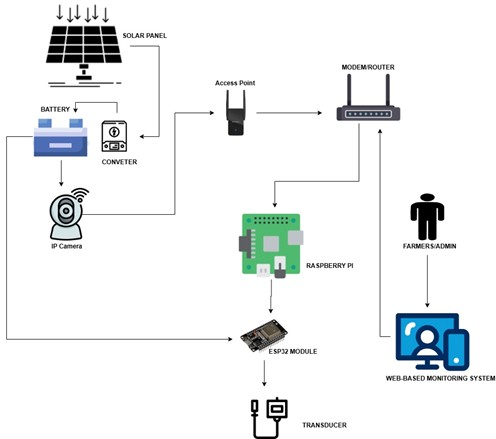
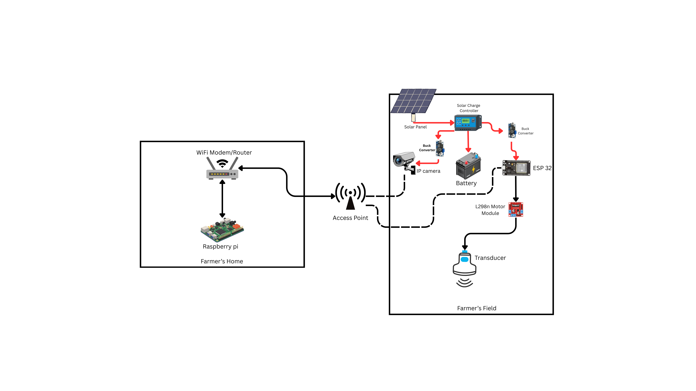
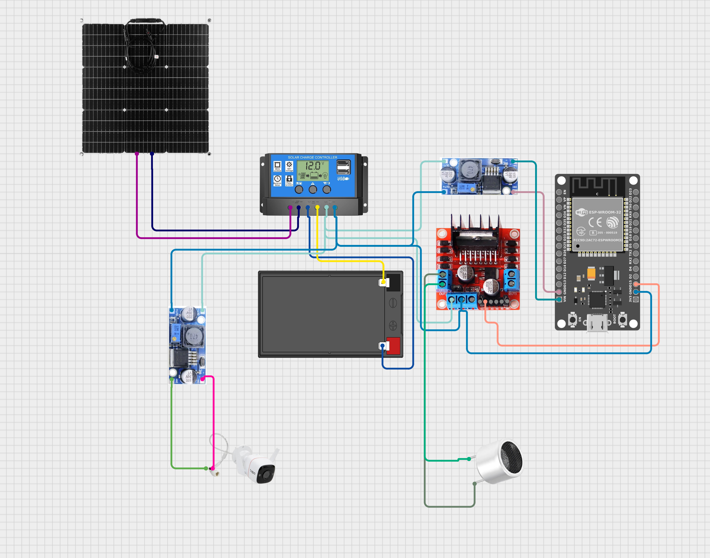
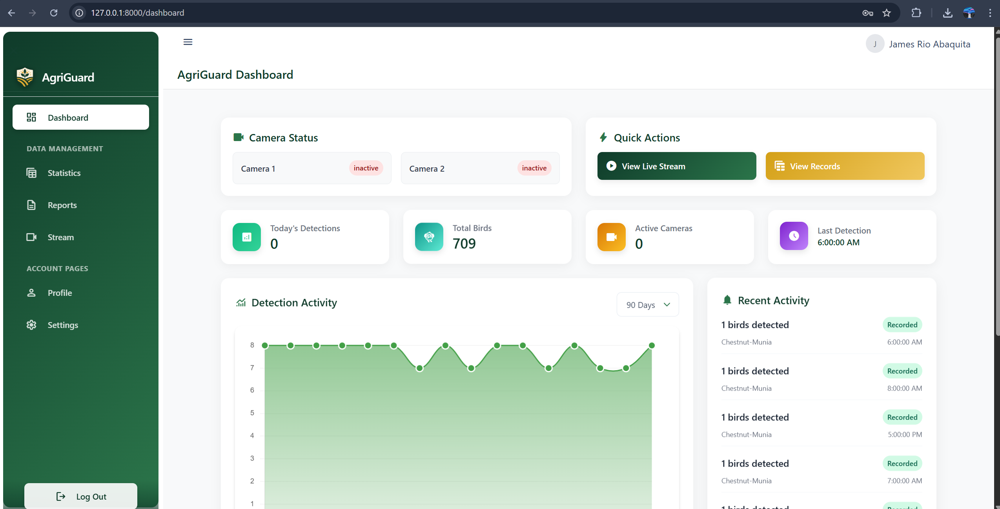
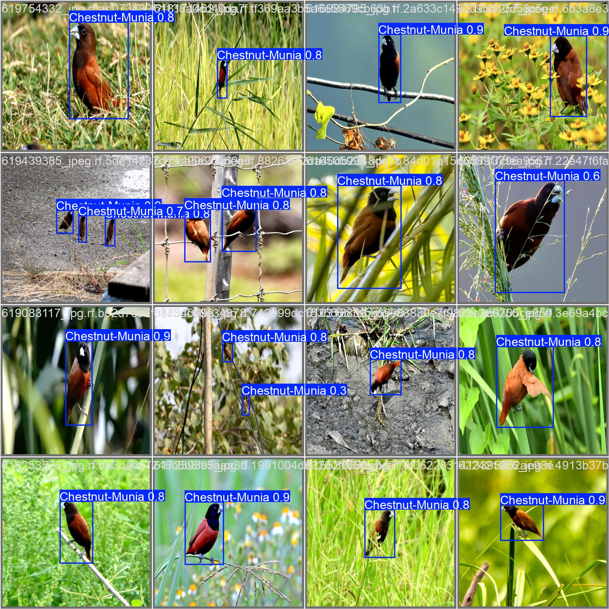
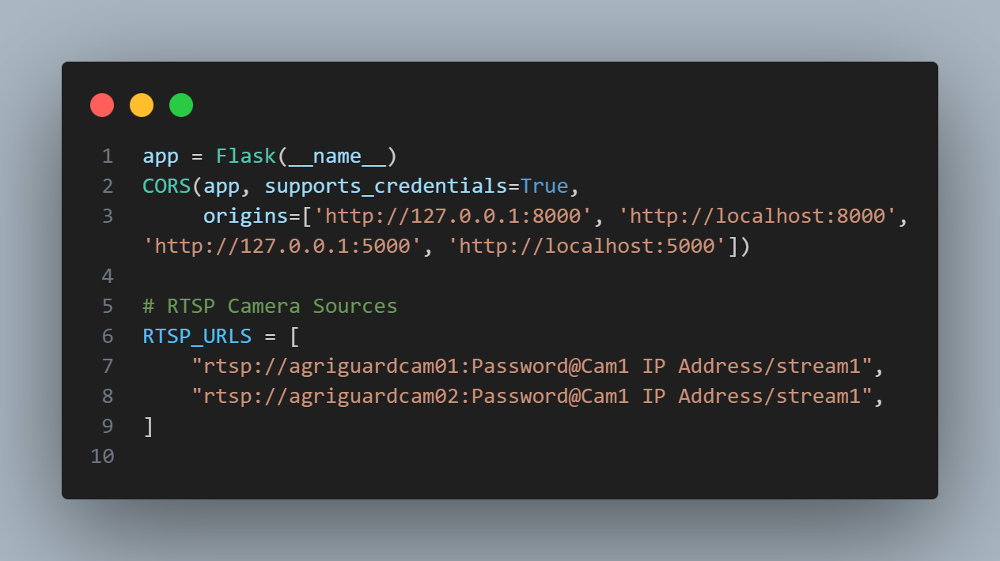
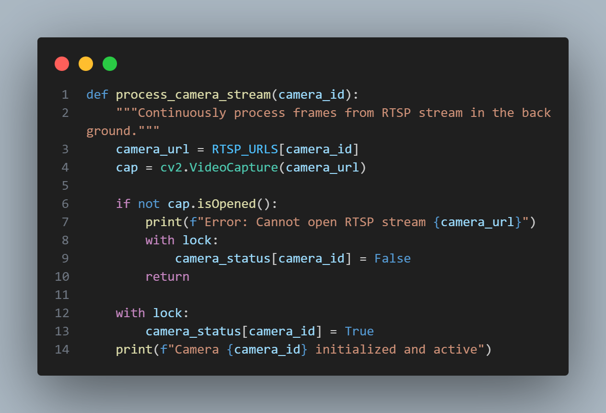
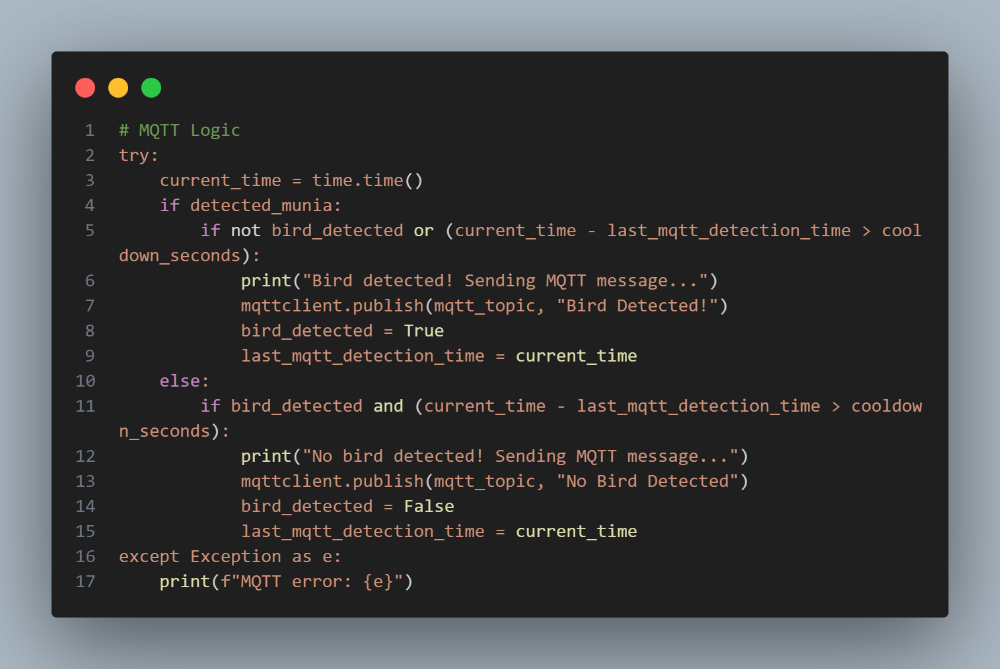
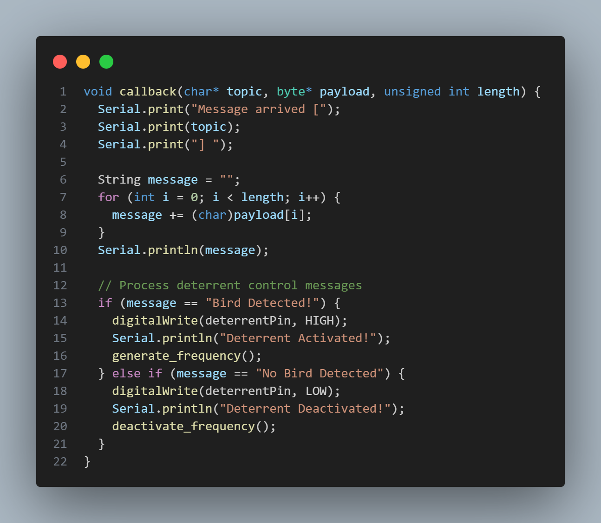

# AgriGuard:IoT-Based Rice Field Protection Against Bird Predation

> **Integrative Systems Project:** An automated, solar-powered solution to prevent crop loss caused by the *Chestnut Munia* (Lonchura atricapilla) during the rice milking stage.

---

## 📸 System Overview

## ⚠️ The Problem: Crop Yield Loss
In Northern Mindanao, rice farmers face severe yield reduction during the **Milking Stage** due to the invasive *Chestnut Munia* bird. 
* **Economic Impact:** Local farmers report losing **50-100 sacks of rice** per harvest compared to projected yields.
* **Manual Labor:** Farmers currently rely on manual guarding—spending entire days roaming fields and banging plastic containers to create noise. This is labor-intensive and inefficient.

## 💡 The Engineering Solution
AgriGuard replaces manual labor with an intelligent **Distributed IoT Architecture** that operates during daylight hours.

### Key Innovations
1.  **Computer Vision Identification:** Unlike generic motion sensors, our system specifically identifies the *Chestnut Munia* using a custom-trained YOLOv8n model, ignoring non-threat movements.
2.  **Ultrasonic Deterrence:** Replacing audible noise (which contributes to noise pollution), we utilize **Ultrasonic Transducers**. This frequency is uncomfortable for birds but inaudible to humans, solving the issue of disturbing nearby residents.
3.  **Distributed Edge Network:** The heavy computing (AI) happens safely at the farmer's home, while the field units are lightweight, low-power, and solar-driven.

---

## ⚙️ How It Works (The Logic)

The system operates on a **Local Offline Network** (No Internet Required), ensuring reliability in remote farm areas.

1.  **Acquisition (Field):** A **Tapo C310 IP Camera** mounted on a solar-powered pole streams video via RTSP over a local Wi-Fi network (extended by a Comfast EW73 AP).
2.  **Processing (Home):** The **Raspberry Pi 4** (acting as the Edge Server) receives the RTSP stream. It runs a **Flask** application with **YOLOv8n** to analyze frames in real-time.
3.  **Decision:** If a *Chestnut Munia* is detected with high confidence, the RPi publishes a trigger message via **MQTT**.
4.  **Action (Field):** An **ESP32** microcontroller subscribed to the topic receives the command and activates the **Ultrasonic Transducer** via an L298N driver.

---

## 🏗️ Hardware Architecture

The system is split into two physical zones to optimize for power, security, and network coverage.

| Zone | Component | Function |
| :--- | :--- | :--- |
| **Zone A: Base Station** (Farmer's Home) | **Raspberry Pi 4** | Central processing unit running AI inference & MQTT Broker. |
| | **Comfast EW73 AP** | Long-range Access Point to extend network to the field. |
| | **Router/Modem** | Host of the local network (LAN). |
| **Zone B: Field Node** (Rice Field) | **ESP32** | IoT Client (receives MQTT commands). |
| | **Tapo C310** | IP Camera for video feed. |
| | **Solar System** | 50W Panel + 30A Controller + 12V 9Ah Battery. |
| | **Deterrent** | Ultrasonic Transducer + L298N Driver + Buck Converters. |

### Field Unit Circuitry (The "Box on the Pole")
> Detailed schematic showing the power distribution (Solar -> Battery -> Buck Converters) and signal paths (ESP32 -> Drivers).

---

## 🌐 Network Engineering & Topology

To ensure low-latency video streaming and reliable control signals in a remote environment, the system utilizes a **Star Topology** on a dedicated **2.4GHz WLAN**.

### Network Configuration Strategy
* **Dedicated Subnet:** The system operates on a secluded `192.168.1.0/24` subnet to prevent IP conflicts with the farmer's home devices.
* **Static IP Assignment:** Critical nodes are assigned Static IPs to ensure consistent routing for RTSP and MQTT connections.
    * **Gateway (Router):** `192.168.1.1`
    * **Edge Server (RPi 4):** `192.168.1.7` (Reserved)
    * **IP Camera (Field):** `192.168.1.20-21` (Stream Source)
    * **ESP32 (Field):** `192.168.1.100` (MQTT Client)
* **Bandwidth Management:** Video traffic (RTSP) is isolated to the high-gain Access Point (Comfast EW73) to maintain consistent **25 FPS** throughput despite the 50m+ distance between Home and Field.

### Data Flow Protocol Stack
| Layer | Protocol | Usage |
| :--- | :--- | :--- |
| **Application** | **RTSP** | High-bandwidth video transport (Camera -> RPi). |
| **Application** | **MQTT** | Low-latency telemetry & control triggers (RPi <-> ESP32). |
| **Transport** | **TCP/UDP** | MQTT uses TCP for guaranteed delivery; RTSP uses UDP for speed. |
| **Network** | **IPv4** | Standard addressing for local node communication. |
| **Physical** | **802.11n** | Wi-Fi link bridged via Long-Range AP. |

---

## 💻 Software Stack

| Domain | Technology | Usage |
| :--- | :--- | :--- |
| **AI / ML** | **YOLOv8n** (Ultralytics) | Object detection model (optimized for speed). |
| **Backend** | **Python 3.10+ & Flask** | Server for handling RTSP streams and inference logic. |
| **Web Dashboard** | **Laravel (PHP)** | User interface for farmers to view logs and status. |
| **Database** | **MySQL** | Storing detection logs and timestamps. |
| **IoT Protocol** | **MQTT** | Lightweight messaging between RPi and ESP32. |
| **Video Protocol** | **RTSP** | Real-time Streaming Protocol for IP Camera. |

---

## 🖥️ System Interface (Web Dashboard)
The system includes a responsive web dashboard to give farmers real-time control and insights.

> **Main Dashboard:** Shows real-time device status, camera feeds, and recent detection statistics.

---

## 📊 Dataset & Model Performance
* **Source:** Images acquired from **eBird.org** and the **Cornell Lab of Ornithology (Macaulay Library)**.
* **Size:** ~4,700 Cleaned Images (filtered from an initial 5,000+).
* **Preprocessing:** Images were curated to remove blurs and irrelevant angles to improve model robustness.
* **Performance:** The model uses **YOLOv8 Nano (n)** version to balance accuracy and speed. While highly performant on GPU-accelerated laptops, it is optimized to run on the Raspberry Pi CPU for edge deployment.

### Model Metrics
| Validation Predictions | Confusion Matrix |
| :---: | :---: |
|  |  |
| *Actual detections on validation data* | *Model accuracy across all classes* |

---

## 🧩 Core Implementation Details

### 1. Real-Time RTSP Stream Processing
This snippet demonstrates how the Flask backend connects to the remote Tapo C310 camera via RTSP, runs inference, and streams the annotated video to the React dashboard.

### 2. MQTT Trigger Logic
This snippet demonstrates how the Raspberry Pi **publishes** the message to activate the transducer when a bird is detected.

---

## 🔒 Source Code Availability

This project was developed as a Capstone/Thesis requirement for Bukidnon State University.
Due to intellectual property policies and pending publication, **the full source code is currently private.**

However, I am happy to provide:
* A code walkthrough via video call.
* Snippets of specific modules (e.g., the YOLO inference loop or MQTT handler) upon request.
* Documentation on the hardware wiring and configuration.

**Author:** James Rio  
*BSIT Senior | IoT & Embedded Systems Engineer* [LinkedIn](https://www.linkedin.com/in/james-abaquita-3a1306394/)